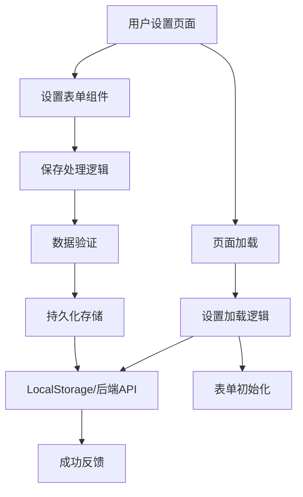
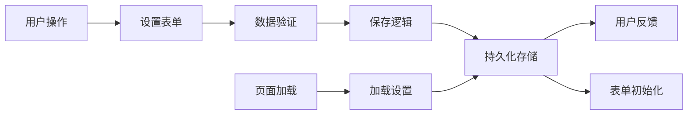

## Product Overview

修复普通用户AI设置持久化功能，确保用户配置的API Key和Base URL等设置能够正确保存并在页面刷新后保持。

## Core Features

- 修复AI设置保存功能
- 确保设置在页面刷新后正确加载
- 验证普通用户权限下的设置持久化
- 测试保存和加载设置的完整性

## Tech Stack

- 前端框架：React (基于现有项目)
- 状态管理：React Context API 或 Redux
- 数据持久化：LocalStorage 或 后端API
- 错误处理：Try-catch 和用户反馈机制
- 调试工具：浏览器开发者工具

## System Architecture

## Module Division

- **设置管理模块**：处理AI设置的保存、加载、验证
- **存储模块**：负责数据的本地存储或API调用
- **表单组件**：用户界面输入和显示
- **权限验证模块**：确保普通用户操作权限

## Data Flow

## 设计风格

采用Material Design风格，确保用户界面简洁直观。使用React + MUI组件库构建设置页面，重点突出保存状态和用户反馈。设计包含成功/错误提示，加载状态指示器，以及表单验证的视觉反馈。

## 页面规划

1. **AI设置页面**：包含API Key、Base URL等配置项的表单
2. **状态反馈区域**：显示保存成功/失败的提示信息
3. **测试连接功能**：验证配置有效性的交互按钮

## 块设计

- **顶部导航栏**：页面标题和返回按钮
- **设置表单区**：API Key输入框（密码类型）、Base URL输入框、其他配置选项
- **操作按钮区**：保存设置、测试连接、重置默认按钮
- **状态提示区**：保存状态、错误信息的即时反馈
- **底部导航**：可选的快速操作入口

## Agent Extensions

### SubAgent

- **code-explorer** (from <subagent>)
- Purpose: 搜索和分析项目中的AI设置相关代码文件
- Expected outcome: 找到设置保存和加载的相关代码，定位持久化问题